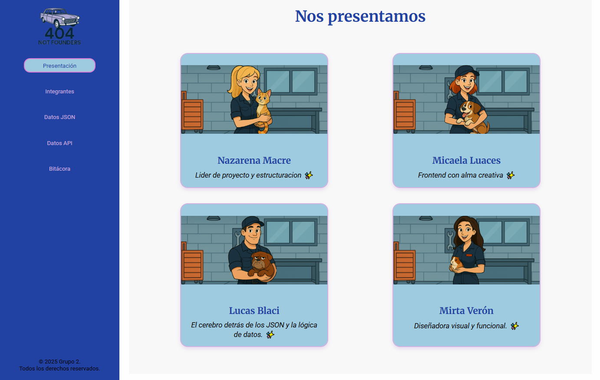
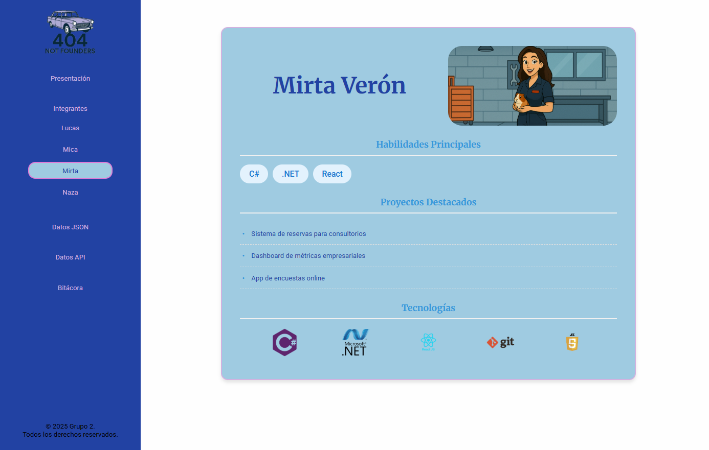
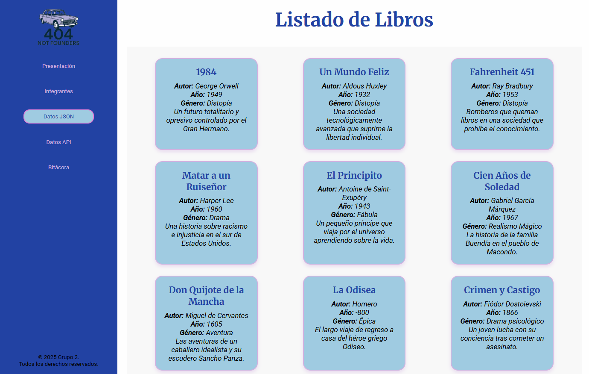
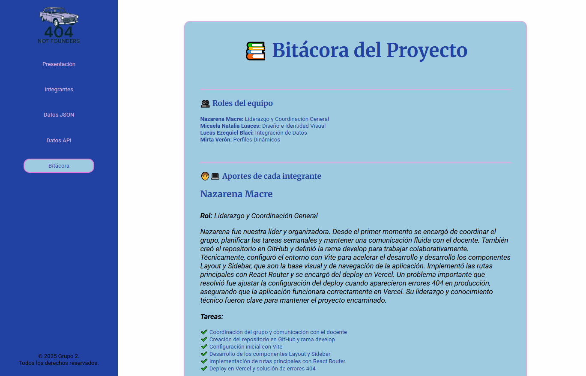

# 🧩 Proyecto React - TP Grupal 1

Aplicación web desarrollada como parte del Trabajo Práctico Grupal N.º 1 del curso. El proyecto consiste en una SPA (Single Page Application) utilizando **React** y **React Router**, aplicando buenas prácticas de desarrollo, diseño responsive, manejo de datos y despliegue en la nube.

---

## 📅 Fechas
- **Inicio del proyecto:** 5 de Mayo  
- **Entrega final:** 2 de Junio

---

## 📸 Capturas de Pantalla

### 🖼️ Presentación del Equipo


### 👥 Perfil Individual


### 📚 Lista de Libros desde JSON


### 🌍 Bitácora


---

## 🚀 Deploy

🔗 Link a la app en Vercel: _[(https://ifts-29-frontend-tp-1-grup.vercel.app/)]_

---

## 📁 Repositorio

🔗 Link al repositorio: _[(https://github.com/Gabycrem/IFTS29-Frontend-TP1-Grup)]_

---

## 👥 Integrantes

- Micaela Natalia Luaces – Diseño e Identidad Visual.  
- Lucas Ezequiel Blaci – Integración de datos.  
- Nazarena Gabriela Macre – Liderazgo y Coordinación General.
- Mirta Veron - Perfiles dinámicos.

---

## 🧩 Funcionalidades

- 🌐 SPA con React y React Router DOM  
- 🧭 Navegación dinámica por rutas  
- 📁 Visualización de datos desde archivo JSON  
- 🌍 Consumo de datos desde API pública  
- 🧑‍💻 Perfiles individuales con rutas dinámicas  
- 🎨 Estilo visual coherente y responsive  
- 📓 Bitácora integrada al proyecto  

---

## ⚙️ Tecnologías y Herramientas

- ⚛️ React + Vite  
- 🧭 React Router DOM  
- 🎨 CSS Modules  
- 📄 JSON  
- ☁️ Vercel  
- 💻 GitHub  
- 📋 Trello  
- 💬 Discord  

---

## 🌲 Estructura del Proyecto

```
src/
├── components/
│   ├── Layout.jsx
│   ├── Sidebar.jsx
│   ├── PresentacionEquipo.jsx
│   ├── ListaAPI.jsx
│   └── Perfil.jsx
├── data/
│   └── libros.json
├── pages/
│   ├── Home.jsx
│   ├── Equipo.jsx
│   └── Comentarios.jsx
├── App.jsx
├── main.jsx
├── index.css
└── styles/
    └── global.css
```

---

## 📌 Estado del Proyecto

✅ Repositorio creado  
✅ Estructura base en React  
✅ Rutas definidas  
✅ Componentes principales  
✅ Consumo de JSON  
✅ Consumo de API pública  
✅ Estilos responsive  
✅ Bitácora final  
✅ Deploy en Vercel  

---

## 📌 Notas Finales

Este proyecto nos permitió aplicar conocimientos teóricos y prácticos de React, aprender a trabajar en equipo y organizar tareas en un entorno colaborativo. Cada integrante aportó desde su rol, fortaleciendo no solo las habilidades técnicas, sino también las comunicacionales y organizativas.
